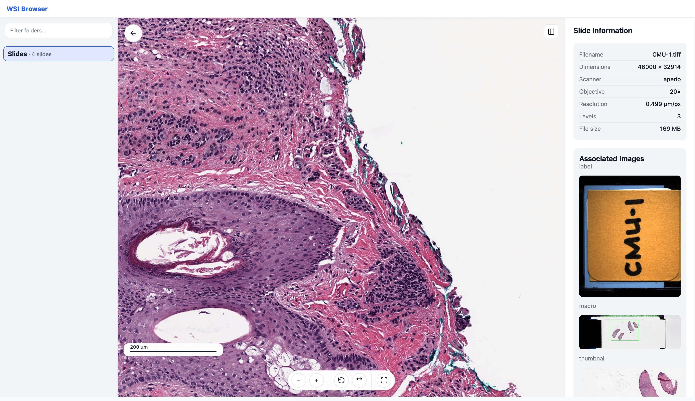

# WSI Browser

A modern, high-performance whole-slide image (WSI) viewer for digital pathology, built with FastAPI, Vue.js, and OpenSeadragon.


## Features

* 🔬 **High-Performance Viewing**: Smooth pan/zoom of gigapixel pathology images using OpenSeadragon
* 📏 **Smart Scale Bar**: Automatic scale bar with µm/mm measurements based on slide metadata
* 🗂️ **File Browser**: Hierarchical folder navigation with search and filtering
* 🖼️ **Thumbnails**: Fast preview generation with viewport-aware lazy loading and concurrency limits
* 📊 **Metadata Display**: View slide properties, scanner info, resolution, and associated images
* 🚀 **Redis Caching**: Shared Redis backend for tiles, thumbnails, directory trees, and **path resolution** across workers
* 💾 **Fallback Cache**: Local pickle-based LRU path cache if Redis is disabled
* 🎯 **Modern Stack**: Python 3.13, FastAPI, Vue.js 3, and containerized deployment
* 🔒 **Production Ready**: Docker setup with health checks, non-root user, and optimized builds

## Screenshots

<details>
<summary>Click to view screenshots</summary>

### Grid View

Browse slides with thumbnails and file information


### Slide Viewer

Pan/zoom with scale bar, metadata panel, and associated images




</details>

## Quick Start

### Using Docker (Recommended)

1. **Clone the repository**

```bash
git clone https://github.com/KatherLab/wsi-browser.git
cd wsi-browser
```

2. **Configure your slide directories**

Edit `docker-compose.yml` to mount your slide directories:

```yaml
volumes:
  - /path/to/your/slides:/path/to/your/slides:ro
```

Create a `config.yml` file (you can copy `config.example.yml`) to reference the mounted paths:

```yaml
roots:
  - path: "/path/to/your/slides"
    label: "My Slides"
```

3. **Build and run**

```bash
docker-compose build
docker-compose up -d
```

4. **Access the application**
   Open your browser to: `http://localhost:8010`

### Local Development

1. **Install dependencies with uv**

```bash
pip install uv
uv sync
```

2. **Configure `config.yml`**

```yaml
roots:
  - path: "/path/to/slides"
    label: "Slide Collection"
    
cache:
  enabled: true
  redis_url: "redis://localhost:6379/0"
```

3. **Run the application**

```bash
uv run uvicorn app.main:app --host 0.0.0.0 --port 8010 --reload
```

## Configuration

### `config.yml` Reference

```yaml
# Slide directories to expose in the UI
roots:
  - path: "/data/slides"
    label: "Research Slides"
  - path: "/data/clinical"
    label: "Clinical Cases"

# Files/folders to exclude
exclude:
  - "__pycache__"
  - "*.tmp"
  - ".git"

# Supported slide formats
extensions:
  - ".svs"      # Aperio
  - ".tif"      # Generic TIFF
  - ".tiff"     
  - ".ndpi"     # Hamamatsu
  - ".scn"      # Leica
  - ".mrxs"     # Mirax (includes .mrxs sidecar directory)
  - ".bif"      # Ventana

# Redis caching configuration
cache:
  enabled: true
  redis_url: "redis://redis:6379/0"  # Use "redis" hostname in Docker
  ttl_seconds:
    tree: 60        # Directory tree cache
    thumb: 86400    # Thumbnail cache (24h)
    tile: 3600      # Tile cache (1h)

# Thumbnail generation
thumbnails:
  max_px: 512               # Maximum thumbnail dimension
  prefer_associated: true   # Use embedded thumbnails when available

# CORS settings
cors_allow_origins: ["*"]   # Restrict in production
```

## Project Structure

```
wsi-browser/
├── app/
│   ├── __init__.py
│   ├── main.py           # FastAPI application
│   ├── cache.py          # Redis caching layer
│   ├── config.py         # Configuration management
│   ├── dz.py             # Deep Zoom tile generation
│   ├── fs_index.py       # File system indexing
│   ├── models.py         # Pydantic models
│   ├── thumbs.py         # Thumbnail generation
│   ├── path_cache.py     # Redis + LRU path cache
│   ├── templates/
│   │   └── index.html    # Vue.js frontend
│   └── static/
│       ├── logo.svg      # Optional branding
│       └── logo.png
├── Dockerfile
├── docker-compose.yml
├── pyproject.toml
├── config.yml
└── README.md
```

## API Endpoints

| Endpoint                                     | Description                                      |
| -------------------------------------------- | ------------------------------------------------ |
| `GET /`                                      | Web UI                                           |
| `GET /api/tree`                              | Directory tree structure                         |
| `GET /api/expand?path=...`                   | Expand a directory shallowly                     |
| `GET /api/dir?path=...`                      | List slides in directory                         |
| `GET /api/thumb/{slide_id}`                  | Slide thumbnail (with ETag caching)              |
| `GET /api/meta/{slide_id}`                   | Slide metadata (with MIRAX sidecar size support) |
| `GET /api/associated/{slide_id}`             | List associated images                           |
| `GET /api/associated/{slide_id}/{name}`      | Get associated image                             |
| `GET /dzi/{slide_id}.dzi`                    | Deep Zoom descriptor (with ETag)                 |
| `GET /dzi/{slide_id}_files/{z}/{x}_{y}.jpeg` | Deep Zoom tiles (with ETag)                      |
| `GET /health`                                | Health check (reports Redis status)              |

## Supported Formats

The application supports all formats readable by OpenSlide:

* **Aperio** (.svs, .tif)
* **Hamamatsu** (.ndpi, .vms, .vmu)
* **Leica** (.scn)
* **MIRAX** (.mrxs + sidecar directory)
* **Philips** (.tiff)
* **Sakura** (.svslide)
* **Trestle** (.tif)
* **Ventana** (.bif, .tif)
* **Generic tiled TIFF** (.tif, .tiff)

## Performance Optimization

### Caching Strategy

* **Redis**: Stores tiles, thumbnails, directory trees, and path lookups (shared across workers)
* **LRU Fallback**: Local pickle cache if Redis is disabled
* **TTL Configuration**: Customizable expiration times for tiles and thumbnails
* **On-demand validation**: Path entries checked for existence on access; stale entries evicted

### Production Settings

* **Multiple Workers**: 4+ Uvicorn workers recommended
* **Read-only Mounts**: Slide directories mounted read-only
* **Health Checks**: `/health` endpoint for container monitoring
* **Non-root User**: Enhanced security in containers

### Docker + Redis Best Practices

* Set `maxmemory` and `maxmemory-policy allkeys-lru` in your Redis config to prevent out-of-memory errors:

  ```conf
  maxmemory 2gb
  maxmemory-policy allkeys-lru
  ```
* Mount slides with `:ro` to enforce read-only access
* Tune NFS mount options for throughput:

  ```
  nfsvers=3,rsize=262144,wsize=262144,hard,noatime
  ```

## Troubleshooting

**Slides not appearing**

* Check file extensions in `config.yml`
* Verify directory permissions
* Confirm Docker volume mounts

**Performance issues**

* Increase Redis memory limit in `docker-compose.yml`
* Adjust worker count based on CPU cores
* Ensure NFS mount options are tuned (`noatime`, larger `rsize/wsize`)

**Connection errors**

```bash
docker-compose ps
docker-compose logs -f
docker-compose exec redis redis-cli ping
curl http://localhost:8010/health
```

## Development

### Adding Features

* Backend: modify `app/` Python modules
* Frontend: edit `app/templates/index.html`
* Rebuild: `docker-compose build && docker-compose up -d`

### Tests & Linting

```bash
uv sync --dev
uv run pytest
uv run ruff check app/
uv run mypy app/
```

## Deployment

### Checklist

* Restrict CORS origins in `config.yml`
* Set up SSL/TLS termination (nginx/traefik)
* Configure monitoring (Prometheus/Grafana)
* Use log aggregation
* Add authentication if needed
* Set up Redis persistence/backups if required

### Scaling

* External Redis cluster for large deployments
* Multiple app instances behind load balancer
* CDN for static assets
* Distributed file system (NFS/GlusterFS) for slides

## License

This project is licensed under the MIT License - see the [LICENSE](LICENSE) file for details.

## Acknowledgments

* [OpenSlide](https://openslide.org/) - C library for reading WSI files
* [OpenSeadragon](https://openseadragon.github.io/) - Deep zoom image viewer
* [FastAPI](https://fastapi.tiangolo.com/) - Modern Python web framework
* [Vue.js](https://vuejs.org/) - Progressive JavaScript framework

## Support

For issues and questions:

* Open an issue on GitHub
* Check existing issues for solutions
* Provide logs and configuration when reporting bugs
